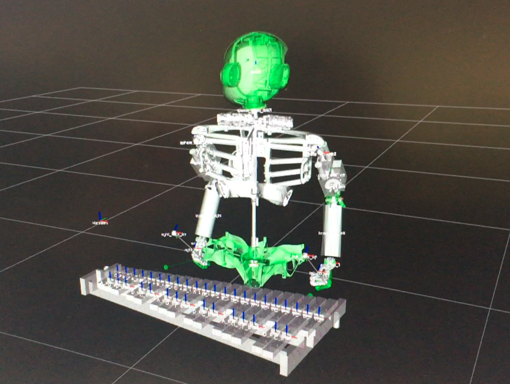

# Roboy Xylophone model


## Prerequisites
1. Install CARDSFlow using [the docs](https://cardsflow.readthedocs.io/en/latest/Usage/0_installation.html). Once installed you should be able to run the Roboy Xylophone model, we will test it later. Do not forget to
```bash
source roboy_control/devel/setup.bash
```

2. Clone [Robots in Musical Improvisation repository](https://github.com/Roboy/tss18-robotsinmusicalimprovisation)

3. Install PyQt5 standalone by
```bash
sudo apt-get install qt5-default
```

4. Create virtual environment for the variational autoencoder GUI in your workspace and activate it, by
```bash
virtualenv .sim_rimi -p python2 --no-site-packages
source .sim_rimi/bin/activate
```

5. Install all requirements for the simulation using:
```bash
pip install -r path/to/tss18-robotsinmusicalimprovisation/simulation_requirements.txt
```

6. If pip install fails due to python-rtmidi, try:
```bash
sudo apt-get install libasound-dev
sudo apt-get install libjack-dev
```

7. Install [PyTorch](https://pytorch.org). If you are using Ubuntu and CUDA 9.0, try:
```bash
pip install torch torchvision
```
8. Connect a MIDI device or use VMPK.

9. You should be able to start the GUI now (make sure virtual environment is activated):
```bash
cd /path/to/tss18-robotsinmusicalimprovisation/software_gui/
python Simulation_GUI.py
```

10. Check this [link](https://github.com/Roboy/tss18-robotsinmusicalimprovisation/tree/master/software_gui) to find out how the GUI works.

10. Start roscore by:
```bash
roscore&
```

11. Start simulation of Roboy Xylophone Model, by:
```bash
roslaunch xylophone_plugin robot.launch robot_name:=roboy_xylophone start_controllers:='sphere_head_axis0 sphere_head_axis1 sphere_head_axis2 sphere_left_axis0 sphere_left_axis1 sphere_left_axis2 elbow_left_rot0 elbow_left_rot1 sphere_right_axis0 sphere_right_axis1 sphere_right_axis2 elbow_right_rot0 elbow_right_rot1 left_wrist_0 left_wrist_1 right_wrist_0 right_wrist_1 hip_joint left_stick_tip_joint right_stick_tip_joint' gazebo:=true xylophone:=true
```

12. Run rviz by (you should be able to see the robot and the xylophone):
```bash
rviz
```

12. In a separate terminal navigate to xylophone_hitter.py and run it without virtual environment by
```bash
cd /path/to/roboy_control/src/xylophone_plugin/scripts/
python xylophone_hitter.py
```

13. The robot should move to a home position and wait for you to play notes into the GUI. Make sure to check Simulate Roboy box in the GUI. This will publish all created MIDI messages via ROS which the robot listens to.
